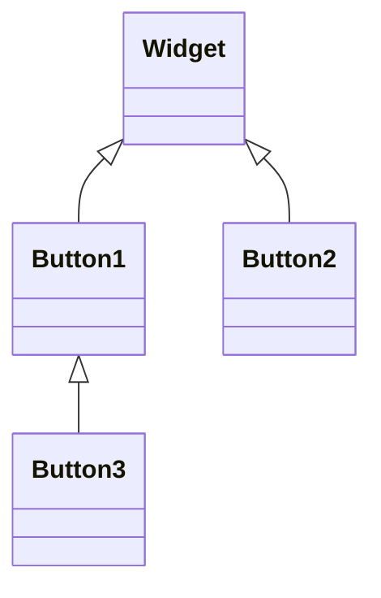

# QT开发

## 1.第一个hello程序

QWidget最基础的窗口类，qt能看到的东西的基类

QMainWindow{菜单栏，工具栏，状态栏}

QDialog{对话框，没有最大化的界面}

- Hello

  - hello.pro//工程配置文件（Windows模式中）

  - ```c++
    #QT是工程模块变量，引入了qt的core和gui模块
    QT		+=core gui
    # 当QT版本>4就引入widgets模块
    greaterThan(QT_MAJOR_VERSION，4): 0T += widgets
    CONFIG += C++11
    #指定目标，生成可执行程序的名字
    TARGET =01_hello
    #模板，生成什么文件，app表示应用程序exe，lib就是生成库
    TEMPLATE=app
    # You can make your code fail to compile if it usesdeprecated APIs.# In order to do so, uncomment the following line.#DEFINES += 0T DISABLE DEPRECATED BEFORE=OX060000# disables all the APIs deprecated before ot 6.0.0
    #用了过时的api就会报warning
    DEFINES+=QT_DEPRECATED_WARNINGS
        
    SOURCES +=\
    	main.cpp\
    	hellowindow.cpp
    HEADERS +=\
    	hellowindow.h\
    FORMS +=\
    	hellowindow.ui
    # Default rules for deplovment.
    qnx: target.path = /tmp/SSTARGETI/bin
    else: unix:!android: target.path = /opt/SSfTARGET}/bin
    !isEmpty(target.path): INSTALLS += target
    ```

    

  - Headers

    - hellowwidget.h

      ```c++
      #ifndef HELLOWINDOW H#define HELLOWINDOW_H
      #include <QWidget>
      class HelloWindow : public OMainwindow
      {
          //宏，引入qt信号和槽的一个宏
      	Q_OBJECT
      public:
          //parent窗口指针，父窗口对象的指针
          //如果parent为0或NULL，表示当前窗口是个顶层窗口
          //顶层窗口就是在任务栏可以找到的窗口
      	Hellowindow(Qwidget *parent = 0);
          ~HeloWidget();
      };
      #endif // HELLOWINDOW H
      ```

  - Source Files

    - mian.cpp

      ```c++
      #include "hellowindow.h"
      #include <QApplication>
      int main(int argc, char *argv[])
      {
      	//Create a Application object
          QApplication a(argc， argv);
      	//An object of the window opject
          Hellowindow w;
      	//show the window
      	w.show();
      	return a.exec();
      }
      ```

      **main函数**

      **QApplication**：是QT里每个应用程序有且仅有一个的应用程序对象

      **QApplication::exec()** 程序的生命循环，消息循环，当作以下形式

      ```c++
      while(1)
      {
          if(点击x按钮)
              break;
          if(点击最小化按钮)
              最小化动作;
          ...
      }
      ```

      Widget头文件：

      **Q_OBJECT**  //宏，引入qt信号和槽的一个宏

      Hellowindow(Qwidget *parent = 0);//parent窗口指针，父窗口对象的指针；如果parent为0或NULL，表示当前窗口是个顶层窗口

### 命名规范：

类名：单词首字母大写，单词和单词之间直接连接，无需连接字符。

```
MyClass
```

QT中内置的类型，头文件和类命名同名。

```
#include<QString>
QString str;
```

类的成员变量设置函数使用set+成员变量名，获取成员变量的函数直接用成员变量名（如果是bool类型，有可能会用一些表示状态的术语，如isVisilble）

```
//普通成员变量设置和获取
void setText(QString text);
QString text()const;
//bool的成员变量设置和获取
void setEnable(bool enable);
bool isEnabled()const;
```

### QtCreator 常用快捷键

运行 ctrl +R
编译 ctrl +B
帮助文档 F1，点击 F1两次跳到帮助界面
跳到符号定义 F2 或者 ctrl + 鼠标点击
注释 ctrl+/
自动对齐ctrl +i
同名之间的.h和.cpp 文件跳转 F4

## 2.PushButton

默认情况下没有建立父子关系，显示的都是顶层窗口

要在窗口上显示组件，则要将组件与窗口构造父子关系

```
setParent函数
构造函数传参
```

QT坐标系是以父类窗口的左上角为（0，0）
右向为x的正向，
向下为y的正向

## QT常用api

```c++
move(x,y)//移动窗口到父窗口的某个坐标
resize(w,h)//重新设置窗口的大小
setFixedSize（w,h）//设置窗口的固定大小
setWindowTitle//设置窗口标题
setGeometry(x,y,w,h)//同时设置窗口位置和大小
```

## 对象树

//局部变量在函数退出的时候会自动释放
解决：

让按钮的生命周期长一点

```c++
//1.static
//2.类成员变量
//3.new 一个，动态分配内存
QPushButton *bt1=new QPushButton("Button1",this);
//没有delet

//验证析构
//再继承一个按钮类，在子类的析构函数里打log
```



对象树的概念：各个窗口对象通过建立父子关系构造一个关系树

内存管理：父对象在释放析构的时候会自动释放子对象（使用children列表）。

以后基本使用new的方式来创建窗口对象

注意点：1.父对象能够被释放。

2. 父对象，子对象，直接或者间接继承自QObject.

### 点击按钮关闭窗口

建立四者的关系（按钮，被点击，窗口，关闭）

```c++
Widget::Widget(QWidget *parent)
	:Qwidget(parent)
{
        QpushButton *btn=new QPushButton("按钮1"，this);
        //关闭 
        //this->close()
        
        //建立四者的关系（按钮，被点击，窗口，关闭）
        connect(btn,&QPushButton::clicked,this,&Widget::close);
	
}
```

## 2.信号和槽机制（Signal&Slot）

**信号**：各种事件
**槽：**响应信号的动作（函数），槽就是一个函数，可以定义在类的任何部分（public，private，protected），可以具有任何参数，也可以被直接调用。槽函数与一般的函数不同之处在于“槽函数可与一个信号关联，当信号被发射时，关联的槽函数自动执行。

当某个事件发生后，如某个按钮被点击了一下，就会发出一个被点击的信号。

当某个对象接收到这个信号后，就会做出一些相关的处理动作（槽 slot）

但是Qt对象不会无故收到某个信号，要想让一个对象收到另一个对象发出的信号，这时候需要建立连接（connect）

连接用QObject::connect()函数实现，基本格式为：

Qt4的型号和槽

使用两个宏SINGAL、SLOT

```c++
QObject::connect(sender,SINGAL(singal()),receiver,SLOT(slot()));
//sender:发射信号的对象名称，
//singal()信号名称，可以看做特殊的函数，有时需要指明参数
//receiver:接受收信号的对象名称
//slot():槽函数，有时需要指明参数
//SINGAL和SLOT是Qt的宏。用于指明信号和槽，并将其转换为相应的字符串
```

connect是QObject类的一个静态函数，而QObject是所有Qt类的基类，在调用时可以忽略前面的限定符，写为

```
connect(sender,SINGAL(singal()),receiver,SLOT(slot()));
```

SIGANL和SLOT宏的原理，就是将后边的参数转成字符串	类似：

```c++
#define toStr(arg)//arg->"arg"
```

Qt5中信号槽使用的是函数地址

### 2.1系统自带的信号和槽

百度

### 2.2 自定义信号和槽

使用规则：

（1） 一个信号可以连接多个槽，

```c++
connect(spinNum,SINGAL(valueChanged(int)),this,SLOT(addFun(int));
connect(spinNum,SINGAL(valueChanged(int)),this,SLOT(updateStatus(int));
```

当一个信号与多个槽函数关联时，槽函数按照建立连接时的顺序依次进行。

当信号和槽函数带有参数时，在connect（）函数里，要写明函数的类型，但可以不写参数名称。

（2） 多个信号可以连接同一个槽

（3） 一个信号可以连接另外一个信号

```c++
connect(spinNum,SINGAL(valueChanged(int)),this,SINGAL(refershinfo(int));
```

当一个信号发射时，也会同时发射另一个信号

（4）**严格情况下，信号与槽的参数个数和类型需要一致，至少信号的参数不能少于槽的参数，如果不匹配，会出现编译错误或运行错误。**

（5） 在使用信号与槽的类中，必须在类的定义中加入宏**Q_OBJECT**。

  (6)  当一个信号被发射时，与其关联的槽函数通常立即被执行，只有当信号关联的所有槽函数执行完毕后，才会执行发射信号处后面的代码 

（7）信号可以断开连接

```c++
disconnect(spinNum,SINGAL(valueChanged(int)),this,SINGAL(refershinfo(int))
```

#### 自定义信号：

1. 函数声明在类头文件的signals域下面
2. void 类型函数（无返回值）
3. 可以有参数，也可以重载
4. 只有声明，，没有实现定义
5. 触发信号 emit obj->sign(参数。。。)

#### 自定义槽：

1. qt5以上可以声明在类任何位置
2. 不仅有声明，还得有实现。

**案例：**

场景:下课了，老师说他饿了，学生就请吃饭信号发送者:老师信号:老师饿了信号接收者:学生槽:请吃饭
创多少个类: Teacher； student
信号: hungry 1个 Teacher
槽: treat 1个 Student

带参数的自定义信号和槽，在声明的时候带上就行

参数二义性问题：

1. 使用函数指针赋值，让编译器自动挑选符合类型的函数
2. 使用static_cast强制转换，让编译器自动挑选符合类型的函数。

### 2.3  QDebug

​	//QDebug默认将QString转义输出

## 3.Lambda表达式

c++11中的Lambda表达式用于定义匿名的函数对象，以简化编程工作

Lambda表达式的基本构成：

分为四个部分：[局部变量捕获列表]、（函数参数）、函数额外属性设置opt、函数返回值->retype、{函数主体}

```c++
[capture](parameters)opt->reType
{
    
}
//调用lambda的方式，使用函数指针
void(*p)()=
[]()
{
    qDebug()<<"Hello Lambda";
};

Widget::~Widget()
{}

//局部变量捕获
//分为两种方式，一种是值传递，一种是引用
//默认情况下值传递捕获进来的局部变量就是const
//= 局部变量全部使用值传递捕获，捕获局部变量包括this
//& 局部变量全部使用应用传递捕获进来
int a=10;
int b=20;
[=,&b]()
{
    qDebug()<<a<<b;
}();
//信号和槽使用Lambda
//以后都使用[=](){}的形式
QPushButton *btn=new QPushButton("Button1",this);
connect(btn,&QPushButton::clicked,[=](){})
```

[capture]捕获外部局部变量的列表，值传递，直接填变量名，引用传递就是使用&变量名
使用=值传递捕获所有局部变量
使用&应用传递捕获所有局部变量
特殊捕获方式另讲
默认情况下值传递捕获进来的局部变量就是const，需要修改的话要用mutable选项
返回值类型可以省略，编译器自动计算返回值
以后都使用[=](){}的形式

## QMainWindow 

是一个为用户提供主窗口程序的类，包含一个菜单栏（menu bar)、多个工具栏（tool bars）、多个停靠部件（dock widgets）、一个状态栏（status bar）以及一个中心部件（central widget）


- mainwidow.cpp

  ```c++
  #include "mainwindow.h"
  #include<QMenuBar>
  #include<QToolBar>
  #include<QLabel>
  #include<QStatusBar>
  #include<QDockWidget>
  #include<QTextEdit>>
  
  MainWindow::MainWindow(QWidget *parent)
      : QMainWindow(parent)
  {
      //菜单栏,获取当前窗口的菜单栏，没有的话就自动创建一个
      QMenuBar *mb=this->menuBar();
      //添加菜单
      QMenu *menuFile  = mb->addMenu("文件");
      QMenu *menuEdit  = mb->addMenu("编辑");
      //往菜单里添加菜单项
      QAction *actionnew=menuFile->addAction("新建");
      QAction *actionopen=menuFile->addAction("打开");
  
      //添加分隔符
      menuFile->addSeparator();
  
      //添加二级菜单
     QMenu *menuRecent= menuFile->addMenu("最近打开");
      menuRecent->addAction("1.txt");
  
      //工具栏，可以有多个
     QToolBar *toolBar= this->addToolBar("");
     //在工具栏中添加工具
     toolBar->addAction(actionnew);
     toolBar->addAction(actionopen);
     //默认停靠在左边
     this->addToolBar(Qt::LeftToolBarArea,toolBar);
     //状态栏，只有一个
     QStatusBar *sB=this->statusBar();
     //往状态栏中添加信息
     //在左侧添加信息
     QLabel *labelLeft=new QLabel("左侧信息",this);
     sB->addWidget(labelLeft);
     //添加右侧信息
     QLabel *labelRight=new QLabel("Right",this);
     sB->addPermanentWidget(labelRight);
  
     //停靠部件，可以有多个
     QDockWidget *dockWidget=new QDockWidget("停靠部件",this);
  
     //默认情况下没有核心部件作为参照物，停靠部件会占满窗口
     this->addDockWidget(Qt::BottomDockWidgetArea,dockWidget);
  
     //添加核心部件
     QTextEdit *textEdit=new QTextEdit(this);
     this->setCentralWidget(textEdit);
  
  
  }
  
  MainWindow::~MainWindow()
  {
  }
  ```

## Ui 文件使用

创建项目的时候保存UI

```c++
//关联ui文件到程序界面
ui->setupUi(this);
```

原理就是qt将ui文件转化为c++代码
要使用ui里面的对象
就直接使用ui->对象名，来获取窗口对象指针

## 资源文件的使用

 1.使用绝对路径(要将资源一起打包发送)

```c++
  ui->actionNew->setIcon(QIcon(""));
```

  2.使用资源文件
    使用资源的路径形式：
        ：+前缀 /目录文件名

```c++
 ui->actionNew->setIcon(QIcon(":/Image/xx.png"));
```

## QDialog 对话框

没有最大化，最小化按钮的窗口

- 模态对话框，就是对话框还没有关闭前不能操作同一个进程的其他窗口
- 非模态对话框，就是对话框没有关闭前也能操作同一个进程的其他窗口

```c++
    connect(ui->actionModel,&QAction::triggered,[=](){
        //创建一个模态对话框
        QDialog dlg(this);
        dlg.exec();
        qDebug()<<"hello";
    }
    );

    connect(ui->actionNonModel,&QAction::triggered,[=](){
        //创建一个非模态对话框

        //QDialog dlg(this);
        //show是非阻塞函数，所以dlg会很快释放，改为new
        QDialog *dlg=new QDialog(this);
        //释放问题，只有父对象释放的时候子对象才释放
        //通过设置窗口的属性，让它关闭窗口的时候自动释放
        dlg->setAttribute(Qt::WA_DeleteOnClose);
        dlg->show();
        //dlg.exec();
        qDebug()<<"hello";
    }
            );
}
```

创建模态：

```c++
QDialog::exec()函数，//是一个阻塞的消息循环
```

创建非模态对话框
使用show函数，直接显示窗口就可以，非阻塞的情况下使用new的方式来创建对话框选项

内存泄漏问题：
						模态对话框关闭后并没有马上释放，通过设置窗口的属性来让其关闭后自动释放

```c++
 dlg->setAttribute(Qt::WA_DeleteOnClose);
```

## 系统标准对话框

[Qt](http://c.biancheng.net/qt/) 为应用程序设计提供了一些常用的标准对话框，如打开文件对话框、选择颜色对话框、信息提示和确认选择对话框、标准输入对话框等，用户无需再自己设计这些常用的对话框，这样可以减少程序设计工作量。

| 对话框                  | 常用静态函数名称                                             | 函数功能                                                     |
| ----------------------- | ------------------------------------------------------------ | ------------------------------------------------------------ |
| QFileDialog 文件对话框  | QString getOpenFileName() QStringList getOpenFileNames() QString getSaveFileName() QString getExistingDirectory() QUrl getOpenFileUrl() | 选择打开一个文件 选择打开多个文件 选择保存一个文件 选择一个己有的目录 选择打幵一个文件，可选择远程网络文件 |
| QcolorDialog 颜色对话框 | QColor getColor()                                            | 选择颜色                                                     |
| QFontDialog 字体对话框  | QFont getFont()                                              | 选择字体                                                     |
| QinputDialog 输入对话框 | QString getText() int getlnt() double getDouble() QString getltem() QString getMultiLineText() | 输入单行文字 输入整数 输入浮点数 从一个下拉列表框中选择输入 输入多行字符串 |
| QMessageBox 消息框      | S[tan](http://c.biancheng.net/ref/tan.html)dardButton information() StandardButton question() StandardButton waming() StandardButton critical() void about() void aboutQt() | 信息提示对话框 询问并获取是否确认的对话框 警告信息提示对话框 错误信息提示对话框 设置自定义信息的关于对话框 关于Qt的对话框 |


实例 samp6_1 演示使用这些对话框，程序运行界面如图 2 所示。下方的文本框显示打开文件的文件名或一些提示信息，某些对话框的输入结果可应用于文本框的属性设置，如字体和颜色。

图 2 实例 samp6_1 运行界面

## QFileDialog 对话框

#### 选择打开一个文件

若要打开一个文件，可调用静态函数 QFileDialog::getOpenFileName()，“打开一个文件”按钮的响应代码如下：

```C++
void Dialog::on_btnOpen_clicked()
{ //选择单个文件
    QString curPath=QDir::currentPath();//获取系统当前目录
    //获取应用程序的路径
    QString dlgTitle="选择一个文件"; //对话框标题
    QString filter="文本文件(*.txt);;图片文件(*.jpg *.gif *.png);;所有文件(*.*)"; //文件过滤器
    QString aFileName=QFileDialog::getOpenFileName(this,dlgTitle,curPath,filter);
    if (!aFileName.isEmpty())
        ui->plainTextEdit->appendPlainText(aFileName);
}
```

QFileDialog::getOpenFileName() 函数需要传递 3 个字符串型参数，分别如下：

1. 对话框标题，这里设置为"选择一个文件"。
2. 初始化目录，打开对话框时的初始目录，这里用QDinxurrentPath()获取应用程序当前目录。
3. 文件过滤器，设置选择不同后缀的文件，可以设置多组文件，如：

QString f ilter="文本文件.txt);;图片文件（* .jpg *.gif *.png);;所有文件（*.*)";

每组文件之间用两个分号隔开，同一组内不同后缀之间用空格隔开。

QFileDialog::getOpenFileName() 函数返回的是选择文件的带路径的完整文件名，如果在对话框里取消选择，则返回字符串为空。

#### 选择打开多个文件

若要选择打开多个文件，可使用静态函数 QFileDialog::getOpenFileNames()，“打开多个文件”按钮的响应代码如下：

```C++
void Dialog::on_btnOpenMulti_clicked()
{ //选择多个文件
    //获取应用程序的路径
    QString curPath=QDir::currentPath();//获取系统当前目录
    QString dlgTitle="选择多个文件"; //对话框标题
    QString filter="文本文件(*.txt);;图片文件(*.jpg *.gif *.png);;所有文件(*.*)"; //文件过滤器

    QStringList fileList=QFileDialog::getOpenFileNames(this,dlgTitle,curPath,filter);
    for (int i=0; i<fileList.count();i++)
        ui->plainTextEdit->appendPlainText(fileList.at(i));
}
```

getOpenFileNames() 函数的传递参数与 getOpenFileName() —样，只是返回值是一个字符串列表，列表的每一行是选择的一个文件。

#### 选择已有目录

选择己有目录可调用静态函数 QFileDialog::getExistingDirectory()，同样，若需要传递对话框标题和初始路径，还应传递一个选项，一般用 QFileDialog::ShowDirsOnly，表示对话框中只显示目录。

静态函数 QCoreApplication::applicationDirPath() 返回应用程序可执行文件所在的目录，getExistingDirectory() 函数的返回值是选择的目录名称字符串。

#### 选择保存文件名

选择一个保存文件，使用静态函数 QFileDialog::getSaveFileName()，传递的参数与 getOpenFileName() 函数相同。只是在调用 getSaveFileName() 函数时，若选择的是一个己经存在的文件，会提示是否覆盖原有的文件。如果提示覆盖，会返回为选择的文件，但是并不会对文件进行实质操作，对文件的删除操作需要在选择文件之后自己编码实现。

如下面的代码，即使选择覆盖文件，由于代码里没有实质地覆盖原来的文件，也不会对选择的文件造成任何影响：

```C++
void Dialog::on_btnSave_clicked()
{//保存文件
    QString curPath=QCoreApplication::applicationDirPath(); //获取应用程序的路径
    QString dlgTitle="保存文件"; //对话框标题
    QString filter="文本文件(*.txt);;h文件(*.h);;C++文件(.cpp);;所有文件(*.*)"; //文件过滤器
    QString aFileName=QFileDialog::getSaveFileName(this,dlgTitle,curPath,filter);
    if (!aFileName.isEmpty())
        ui->plainTextEdit->appendPlainText(aFileName);
}
```

## QColorDialog 对话框

QColorDialog 是选择颜色对话框，选择颜色使用静态函数 QColorDialog::getColor()。下面是“选择颜色”按钮的代码，它为文本框的字体选择颜色。

```C++
void Dialog::on_btnColor_clicked()
{
    QPalette pal=ui->plainTextEdit->palette(); //获取现有 palette
    QColor  iniColor=pal.color(QPalette::Text); //现有的文字颜色
    QColor color=QColorDialog::getColor(iniColor,this,"选择颜色");
    if (color.isValid()) //选择有效
    {
        pal.setColor(QPalette::Text,color); //palette 设置选择的颜色
        ui->plainTextEdit->setPalette(pal); //设置 palette
    }
}
```

getColor() 函数需要传递一个初始的颜色，这里是将palette提取的文本颜色作为初始颜色。getColor() 函数返回一个颜色变量，若在颜色对话框里取消选择，则返回的颜色值无效，通过 QColor::isValid() 函数来判断返回是否有效。

## QFontDialog 对话框

QFontDialog 是选择字体对话框，选择字体使用静态函数 QFontDialog::getFont()。下面是“选择字体”按钮的代码，它为文本框选择字体，字体设置的内容包括字体名称、大小、粗体、斜体等。

```C++
void Dialog::on_btnFont_clicked()
{//选择字体
    QFont iniFont=ui->plainTextEdit->font(); //获取文本框的字体
    bool   ok=false;
    QFont font=QFontDialog::getFont(&ok,iniFont); //选择字体
    if (ok) //选择有效
        ui->plainTextEdit->setFont(font);
}
```

gctFont() 返回一个字体变量，但是 QFont 没有类似于 isValid() 的函数来判断有效性，所以在调用 getFont() 函数时以引用方式传递一个逻辑变量 ok，调用后通过判断 ok 是否为 true 来判断字体选择是否有效。

## QInputDialog标准输入对话框

QInputDialog 有单行字符串输入、整数输入、浮点数输入、列表框选择输入和多行文本等多种输入方式，图 3 是其中 4 种界面效果。


图 3 QinputDialog 4种输入对话框

#### 输入文字

QInputDialog::getText() 函数显示一个对话框用于输入字符串，传递的参数包括对话框标题、提示标签文字、缺省输入、编辑框响应模式等。

其中编辑框响应模式是枚举类型 QLineEdit::EchoMode，它控制编辑框上文字的显示方式，正常情况下选择 QLineEdit::Normal；如果是输入密码，选择 QLineEdit::Password。代码如下：

```C++
void Dialog::on_btnInputString_clicked()
{ //输入字符串
    QString dlgTitle="输入文字对话框";
    QString txtLabel="请输入文件名";
    QString defaultInput="新建文件.txt";
    QLineEdit::EchoMode echoMode=QLineEdit::Normal;//正常文字输入
    //QLineEdit::EchoMode echoMode=QLineEdit::Password;//密码输入
    bool ok=false;
    QString text = QInputDialog::getText(this, dlgTitle,txtLabel, echoMode,defaultInput, &ok);
    if (ok && !text.isEmpty())
        ui->plainTextEdit->appendPlainText(text);
}
```

#### 输入整数

使用 QInputDialog::getInt() 函数输入一个整数，下面的代码为文本选择字体大小：

```C++
void Dialog::on_btnInputInt_clicked()
{//输入整数
    QString dlgTitle="输入整数对话框";
    QString txtLabel="设置字体大小";
    int defaultValue=ui->plainTextEdit->font().pointSize(); //现有字体大小
    int minValue=6, maxValue=50,stepValue=1; //范围，步长
    bool ok=false;
    int inputValue = QInputDialog::getInt(this, dlgTitle,txtLabel,
                               defaultValue, minValue,maxValue,stepValue,&ok);
    if (ok) //是否确认输入
    {
        QFont   font=ui->plainTextEdit->font();
        font.setPointSize(inputValue);
        ui->plainTextEdit->setFont(font);
    }
}
```

输入整数对话框使用一个 SpinBox 组件输入整数，getInt() 需要传递的参数包括数值大小范围、步长、初始值，确认选择输入后，将输入的整数值作为文本框字体的大小。

#### 输入浮点数

使用 QInputDialog::getDouble() 函数输入一个浮点数，输入对话框使用一个 QDoubleSpinBox 作为输入组件，getDouble() 的输入参数需要输入范围、初始值、小数点位数等。代码如下：

```C++
void Dialog::on_btnInputFloat_clicked()
{ //输入浮点数
    QString dlgTitle="输入浮点数对话框";
    QString txtLabel="输入一个浮点数";
    float defaultValue=3.13;

    float minValue=0, maxValue=10000;  //范围
    int decimals=2;//小数点位数

    bool ok=false;
    float inputValue = QInputDialog::getDouble(this, dlgTitle,txtLabel,
                            defaultValue, minValue,maxValue,decimals,&ok);
    if (ok) //确认选择
    {
        QString str=QString::asprintf("输入了一个浮点数:%.2f",inputValue);
        ui->plainTextEdit->appendPlainText(str);
    }
}
```

#### 下拉列表选择输入

使用 QInputDialog::getItem() 可以从一个 ComboBox 组件的下拉列表中选择输入。代码如下：

```C++
void Dialog::on_btnInputItem_clicked()
{ //条目选择输入
    QStringList items; //ComboBox 列表的内容
    items <<"优秀"<<"良好"<<"合格"<<"不合格";

    QString dlgTitle="条目选择对话框";
    QString txtLabel="请选择级别";
    int     curIndex=0; //初始选择项
    bool    editable=true; //ComboBox是否可编辑
    bool    ok=false;
    QString text = QInputDialog::getItem(this, dlgTitle,txtLabel,items,curIndex,editable,&ok);

    if (ok && !text.isEmpty())
        ui->plainTextEdit->appendPlainText(text);
}
```

getItem() 函数需要一个 QStringList 变量为其 ComboBox 组件做条目初始化，curIndex 指明初始选择项，editable 表示对话框里的ComboBox是否可编辑，若不能编辑，则只能在下拉列表中选择。

## QMessageBox 消息对话框

#### 简单信息提示

消息对话框 QMessageBox 用于显示提示、警告、错误等信息，或进行确认选择，由几个静态函数实现这些功能（详见表 1)。其中 warning()、information()、critical() 和 about() 这几个函数的输入参数和使用方法相同，只是信息提示的图标有区别。

例如，warning() 的函数原型是：

```C++
StandardButton QMessageBox::warning(QWidget *parent, const QString &title, const QString &text, StandardButtons buttons = Ok, StandardButton defaultButton = NoButton)
```

其中，parent 是对话框的父窗口，指定父窗口之后，打开对话框时，对话框将自动显示在父窗口的上方中间位置；title 是对话框标题字符串；text 是对话框需要显7K的信息字符串；buttons 是对话框提供的按钮，缺省只有一个 OK 按钮；defaultButton 是缺省选择的按钮，缺省表示没有选择。

warning() 函数的返回结果是 StandardButton 类型。对话框上显示的按钮和缺省选中按钮也是 StandardButton 类型。

StandardButton 是各种按钮的定义，如 OK、Yes、No、Cancel 等，其枚举取值是 QMessageBox::Ok、QMessageBox::Cancel、QMessageBox::Close 等。

详见 Qt 帮助文档中的StandardButton 类型的说明。

对于 warning()、information()、critical() 和 about() 这几种对话框，它们一般只有一个 OK 按钮，且无须关心对话框的返回值。所以，使用缺省的按钮设置即可。


图 4 QMessageBox 的几种消息提示对话框


例如，下面是程序中调用 QMessageBox 信息显示的代码（显示的几个对话框如图 4 所示）：

```C++
void Dialog::on_btnMsgInformation_clicked()
{
    QString dlgTitle="information消息框";
    QString strInfo="文件已经打开，字体大小已设置";
   QMessageBox::information(this, dlgTitle, strInfo,
                              QMessageBox::Ok,QMessageBox::NoButton);
}

void Dialog::on_btnMsgWarning_clicked()
{
    QString dlgTitle="warning 消息框";
    QString strInfo="文件内容已经被修改";

    QMessageBox::warning(this, dlgTitle, strInfo);
}

void Dialog::on_btnMsgCritical_clicked()
{
    QString dlgTitle="critical消息框";
    QString strInfo="有不明程序访问网络";
    QMessageBox::critical(this, dlgTitle, strInfo);
}

void Dialog::on_btnMsgAbout_clicked()
{
    QString dlgTitle="about消息框";
    QString strInfo="我开发的数据查看软件 V1.0 \n 保留所有版权";
    QMessageBox::about(this, dlgTitle, strInfo);
}
```

#### 确认选择对话框

QMessageBox::question() 函数用于打开一个选择对话框，提示信息，并提供 Yes、No、OK、Cancel 等按钮，用户单击某个按钮返回选择，如常见的文件保存确认对话框如图 5 所示。


图 5 QMessageBox:: question() 生成的对话框
静态函数 QMessageBox::question() 的原型如下：

StandardButton QMessageBox::question(QWidget *parent, const QString &title, const QString &text, StandardButtons buttons = StandardButtons( Yes | No ), StandardButton defaultButton = NoButton)

question() 对话框的关键是在其中可以选择显示多个按钮，例如同时显示 Yes、No、OK 或 Cancel() 其返回结果也是一个 StandardButton 类型变量，表示哪个按钮被单击了。

下面是产生如图 5 所示对话框的代码，并根据对话框选择结果进行了判断和显示：

```C++
void Dialog::on_btnMsgQuestion_clicked()
{
    QString dlgTitle="Question消息框";
    QString strInfo="文件已被修改，是否保存修改？";

    QMessageBox::StandardButton  defaultBtn=QMessageBox::NoButton; //缺省按钮

    QMessageBox::StandardButton result;//返回选择的按钮
    result=QMessageBox::question(this, dlgTitle, strInfo,
                      QMessageBox::Yes|QMessageBox::No |QMessageBox::Cancel,
                      defaultBtn);

    if (result==QMessageBox::Yes)
        ui->plainTextEdit->appendPlainText("Question消息框: Yes 被选择");
    else if(result==QMessageBox::No)
        ui->plainTextEdit->appendPlainText("Question消息框: No 被选择");
    else if(result==QMessageBox::Cancel)
        ui->plainTextEdit->appendPlainText("Question消息框: Cancel 被选择");
    else
        ui->plainTextEdit->appendPlainText("Question消息框: 无选择");
}
```

## 布局

所谓 GUI 界面，归根结底，就是一堆组件的叠加。我们创建一个窗口，把按钮放上面，把图标放上面，这样就成了一个界面。在放置时，组件的位置尤其重要。我们必须要指定组件放在哪里，以便窗口能够按照我们需要的方式进行渲染。这就涉及到组件布局定位的机制。

Qt 提供了两种组件布局定位机制:**静态布局**和**动态布局**。

- **静态布局：**就是一种最原始的定位方法: 给出这个组件的坐标和长宽值。
  这样，Qt 就知道该把组件放在哪里以及如何设置组件的大小。但是这样做带来的一个问题是，如果用户改变了窗口大小，比如点击最大化按钮或者使用鼠标拖动窗口边缘，采用静态布局的组件是不会有任何响应的。这也很自然，因为你并没有告诉 Qt，在窗口变化时，组件是否要更新自己以及如何更新。或者，还有更简单的方法: 禁止用户改变窗口大小。但这总不是长远之计。

- **动态布局:** 你只要把组件放入某一种布局(layout),布局由专门的布局管理器进行管理。当需要调整大小或者位置的时候，Qt 使用对应的布局管理器进行调整。
  动态布局解决了使用静态布局的缺陷。提供的动态布局中以下三种是我们最常用的:

常用动态布局
水平、垂直、栅格、表单布局
推荐使用widget的自带的布局功能

栅格布局可以将空间分为几行几列的表格，
使用弹簧来设置布局位置.
大小策略:默认情况下动态布局，子窗口的大小会跟着父窗口的大小变化而变化，调整水平或者垂直策略，变成固定
调整子窗口和父窗口之间的间隙：设置父窗口的margin，
调整子窗口之间的间隙就调整spacing
调整窗口的固定大小，就是将窗口的最大值和最小值设为同一个值

## 按钮组QButtonGroup

构造：

```c++
	QButtonGroup::QButtonGroup ( QObject * parent = 0 );
```

radio button 单选按钮，互斥域的问题，如果想将某些单选按钮隔开，就用容器将他们隔离，一般用Group Box
check box 多选按钮，有三态tristate,每次点击按钮的时候stateChange 信号里面传进来

## 容器：
